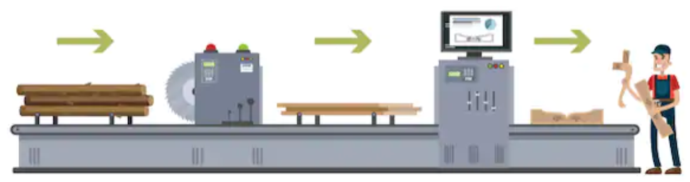
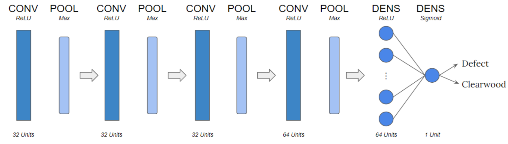
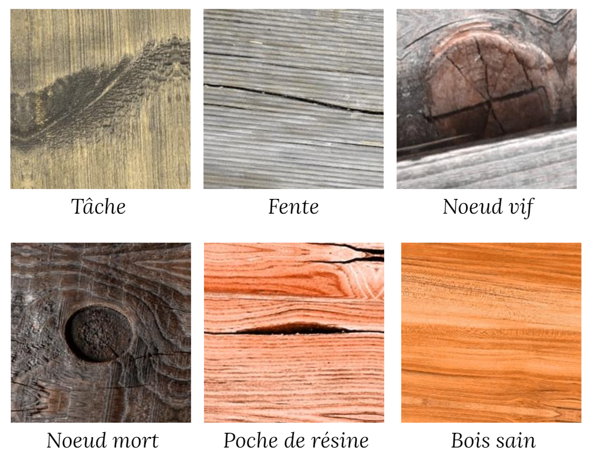
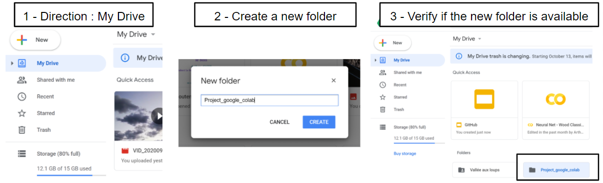
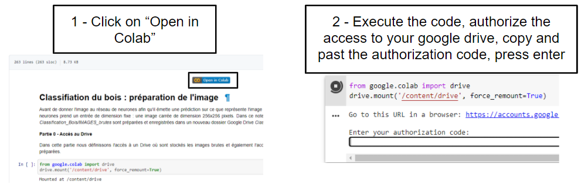
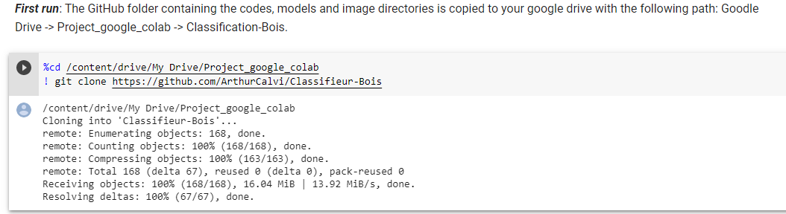
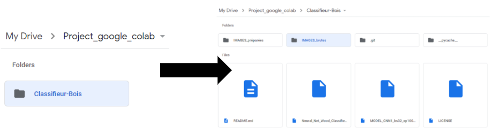
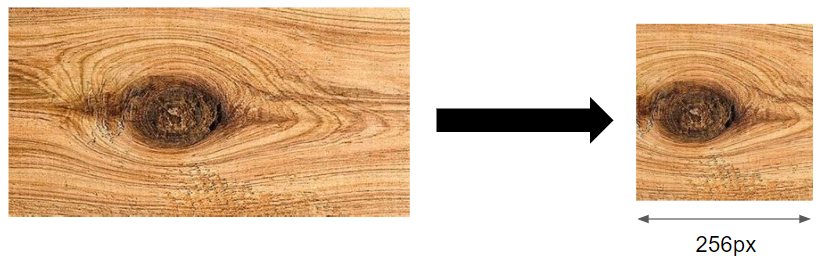
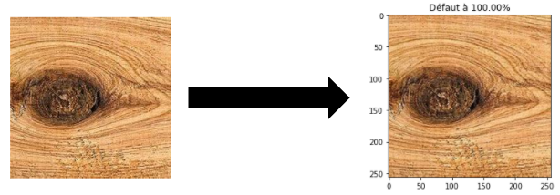

Firstly, I invite you to check the [ReadMe file](https://github.com/ArthurCalvi/Classifieur-Bois/blob/master/README.md) to have insights on the repository. 
Usefull link : [Repository](https://github.com/ArthurCalvi/Classifieur-Bois/tree/master). 

## Filtering the false Positives, why?

In our case, a false positive is an image of clearwood detected by the detection algorithm as an image of wood defect *(live or dead knot, pitch pocket, split or stain)*. The detection algorithm is used to classify woodboard, woodbeam, ... Thus, a false positive could lead to a negative classification error and then to an economic loss for the manufacturer. As contrary, a false negative is an image of a wood defect that has been detected by the algorithm as clearwood. A false negative could lead to a positive classification error and thus to customer risk. Unfortunately, decreasing the rate of false negatives could only be done by improving the core of the detection algorithm. However, decreasing the rate of false positive is much more easier : you just have to add a filter after the detection which remove the false positives. In this website, I provide a simple binary classifier *(Neural network)* which is able to distinguish clearwood from defects and which can be used as a false positives filter.

## The Filter

The filter is a convolutional neural network acting like a binary classifier. The architecture of the neural network is almost the same as Yann Lecun one. It is composed by 8 hidden layers, 3x3 kernel for convolution layer and 2x2 kernel for pooling layer. This neural network has approximatively 600k parameters. The both low complexity and low number of parameters of the net facilitate its training on a small dataset.

## The training dataset

The training dataset is composed by 400 images downloaded on google images. Half of these images are clearwood and the other half contains 5 different types of defect : *(1) Live knot, (2) dead knot, (3) stain, (4) pitch pocket, (5) stain*. Those 5 categories of defect have been chosen because firstly they are the most common defects encountered and secondly they are the defects used by the *Eurocode* to visually estimate the mechanical properties of wood.

As the purpose of this project is to create a starting point to automatic wood classification, the dataset contains more than 200 different wood species. This parameter is important because according to the nature of the wood : hardwood of softwood and also the species the aspect of the defects could vary. Therefore, I tried to create the more unbiased dataset I could to provide a binary classifier which performs well on every species of wood. Afterwhile, you can create a dataset with only one specie of wood and then train the neural net on this particular dataset in order to be more accurate on this very specie.

## What for and How to use it ? 
  
### Where can I upload images for prediction? 

In order to predict the nature of a particular image, you should add this image to a specific folder on your Google Drive. Why on Google Drive? Because codes are hosted on google colaboratory and these codes will be cloned on your Google Drive. This will create folders on your Google Drive where images can be uploaded and then easily processed by the neural network.

*Tutorial : How to configure your google drive :*

  -   Please create a folder named "Project_google_colab" in My Drive/.

  -   Launch this *Jupyter* notebook on google colab : [Jupyter Notebook 1 - Images preprocessing](https://github.com/ArthurCalvi/Classifieur-Bois/blob/master/Images_preprocessing.ipynb).
  

  -  Just execute the line "***First run***". It will clone the GitHub repository on your Google Drive. 
  

Your Google Drive should be configured by now. Open the folder /Project_google_colab, a new folder named /Classifieur-Bois should be here. Open it! This folder contains 4 folders. You can directly upload your images in the folder /IMAGES_raw.

In the folder /IMAGES_raw you can upload *.jpg* images. The resolution doesn't matter but the short side of the image should be at least *256*px wide. 

### How can I preprocess images for the neural net? 

Now that you have uploaded the images, you should process them a bit to use the neural net. You may use this [Jupyter Notebook 1 - Images preprocessing](https://github.com/ArthurCalvi/Classifieur-Bois/blob/master/Images_preprocessing.ipynb) to do it (Open it in Google Colab). This notebook rescales and reshapes images of the /IMAGES_raw folder to square images of *256x256* px in order to be processed by the neural net. You just have to follow the instructions on the notebook. The preprocessed images are saved in the /IMAGES_preprocessed folder.

### How can I predict the nature of these images? 
Now that the images are ready you will predict the nature of these images. To do so, you will use this [Jupyter Notebook 2 - Image prediction](https://github.com/ArthurCalvi/Classifieur-Bois/blob/master/Image_prediction.ipynb) (Open it in Google Colab). Again, you just have to follow the instructions on the notebook.

## How to create a new dataset and How to filter out false positives from a dataset.

In addition, two more Jupyter Notebooks are available :
- [Jupyter Notebook 3 - Creation of your dataset](https://github.com/ArthurCalvi/Classifieur-Bois/blob/master/Creation_of_your_dataset.ipynb) : Use this notebook to create or to widden a dataset. 
- [Jupyter Notebook 4 - Filter](https://github.com/ArthurCalvi/Classifieur-Bois/blob/master/Filter.ipynb) : Use this notebook to filter out false positives from a dataset. 

**Enjoy** ! 
